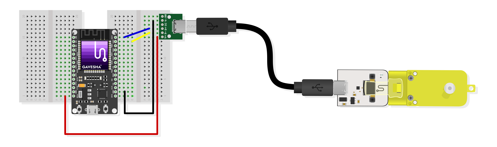

# Overview


Hello Explorers! It's time to build super fun robots!


The **Gavesha® Robomatics Gear Motor Element** is a compact TT gear motor with an inbuilt motor driver and USB Type-C connector, designed to help beginners quickly build a variety of moving objects without hassle. This element is compatible with the Gavesha Console, ESP32, Arduino UNO, Mega, and NodeMCU boards. To learn more about Robomatics Gear Motor Element hardware you can refer the [data sheet]();

This document aims to help you get started with the Arduino IDE quickly. If you're interested in learning how to use this element with MicroPython, please refer to the [Gavesha Project]().


## Installing the Library on Arduino

1. **Download the Library:**
   - Click on the "Code" button in the GitHub repository.
   - Select "Download ZIP" to download the library as a ZIP file.

2. **Add the Library to Arduino:**
   - Open the Arduino IDE.
   - Navigate to `Sketch` -> `Include Library` -> `Add .ZIP Library...`.
   - Select the downloaded ZIP file and click `Open`.
   - That's it! Your library is now installed and ready to use.


## Wiring Guidelines

This section shows you how to wire the Robomatics Gear Motor Element with the most popular Arduino-compatible boards.

### 1. Connecting to ESP32

The diagram below shows how to connect the Robomatics Gear Motor Element to an ESP32 board. You will need a USB-C to DIP connector and a few jumper wires as shown in the diagram.



This library uses PWM to drive the motor. Therefore, you need to select PWM pins to make the device function properly. Luckily, the ESP32 has 16 PWM pins. The table below shows them. Pick any two of them and connect the `D+` and `D-` from the motor.

| Board	|PWM Pins |
|-------|---------|
| ESP32	| 2, 4, 12-19, 21-23, 25-27, 32-33 |

### 2. Connecting to Arduino Uno

The diagram below shows how to connect the Robomatics Gear Motor Element to an Arduino Uno board. You will need a USB-C to DIP connector and a few jumper wires as shown in the diagram.


This library uses PWM to drive the motor. Therefore, you need to select PWM-supported pins to make the device function properly. The table below shows the PWM pins for different Arduino boards. Pick any two of them accordingly and connect the `D+` and `D-` from the motor.

| Board      | PWM Pins              |
|------------|-----------------------|
| Uno        | 3, 5, 6, 9, 10, 11    |
| Nano       | 3, 5, 6, 9, 10, 11    |
| Mini       | 3, 5, 6, 9, 10, 11    |
| Mega       | 2-13, 44-46           |
| GIGA R1    | 2-13                  |


## Library Usage and API Guidelines

This section provides a guide on how to use this library, including creating a motor object, setting motor speed and direction, mirroring the operation, and changing the motor driving modes.

### Creating a Motor Object

To create a motor object, you need to include the `RobomaticsGearMotor` library and specify the PWM pins connected to the motor:

```cpp
#include <RobomaticsGearMotor.h>

// Select PWM pins
int pin1 3;
int pin2 5;

// Create a motor object with pin1 and pin2
RobomaticsGearMotor motor(pin1, pin2);
```

### Setting Motor Speed and Changing Direction

You can set the speed of the motor using the `speed` function. The speed can be set between -255 and 255, where negative values reverse the direction:

```cpp
// Set motor speed to 150 (forward direction)
motor.speed(150);

// Set motor speed to -150 (reverse direction)
motor.speed(-150);
```

### Mirroring the Operation

To mirror the motor operation, use the `mirror` function. This is useful for robotic applications where you need to invert the motor's movement:

```cpp
// Enable mirroring
motor.mirror(true);

// Disable mirroring
motor.mirror(false);
```

### Changing the Motor Driving Modes

The library supports two driving modes: drive-lock and drive-coast.

- **Drive-lock mode**: The motor stops immediately when the speed is set to 0. This is the default mode.
- **Drive-coast mode**: The motor gradually slows down when the speed is set to 0.

You can switch between these modes using the `fineControlMode` function:

```cpp
// Enable drive-lock mode
motor.fineControlMode(true);

// Enable drive-coast mode
motor.fineControlMode(false);
```

By following these guidelines, you can effectively control your Robomatics Gear Motor and integrate it into your projects with ease. 

Enjoy making!